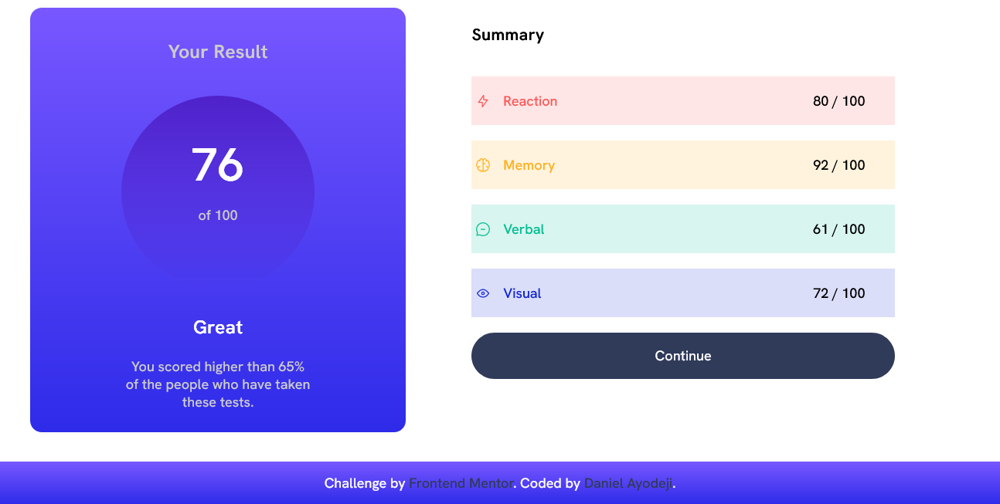
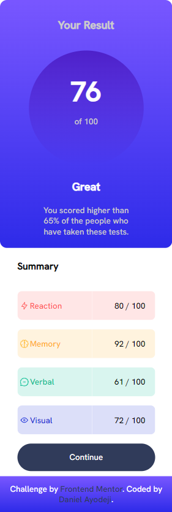

# Frontend Mentor - Results summary component solution

This is a solution to the [Results summary component challenge on Frontend Mentor](https://www.frontendmentor.io/challenges/results-summary-component-CE_K6s0maV).

## Table of contents

- [Overview](#overview)
  - [The challenge](#the-challenge)
  - [Screenshot](#screenshot)
  - [Links](#links)
- [My process](#my-process)
  - [Built with](#built-with)
  - [What I learned](#what-i-learned)
  - [Continued development](#continued-development)
  - [Useful resources](#useful-resources)
- [Author](#author)

**Note: Delete this note and update the table of contents based on what sections you keep.**

## Overview

### The challenge

The project is about:

- Building a result summary component
- Using different CSS styles and frameworks to create a visually appealing website

### Screenshot

### Links

- Solution URL: [Add solution URL here](https://your-solution-url.com)
- Live Site URL: [Add live site URL here](https://your-live-site-url.com)

## My process
- I rearranged the HTML file given in the challenges
- I created a CSS file to design the web page and linked it to the HTML file
- In the CSS file, I displayed the main div with CSS grid and styled each side to satisfaction

### Built with

- Semantic HTML5 markup
- CSS custom properties
- CSS Grid
- Mobile-first workflow

### What I learned

I learnt how to style table rows. I had never tried styling a table row before but with this challenge I learnt how to use tr td:first-child {} and tr td:last-child{} to style respective table rows.

### Continued development

I want to work more on projects that have to do with animations next time because I am not really confident about it.

### Useful resources

https://stackoverflow.com/questions/4094126/how-to-add-border-radius-on-table-row

## Author

- Frontend Mentor - [@Dannyjohn03](https://www.frontendmentor.io/profile/Dannyjohn03)
- Twitter - [@Dannyjohn003](https://www.twitter.com/Dannyjohn003)
